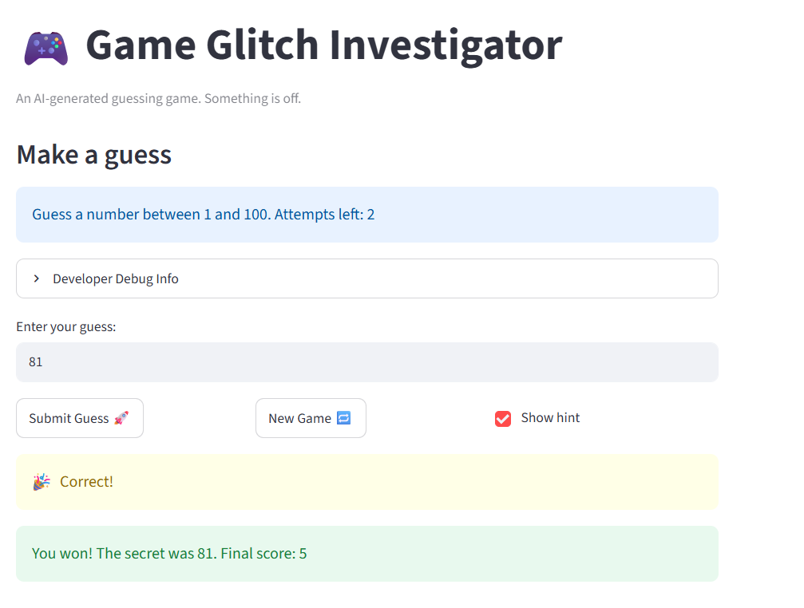

# 🎮 Game Glitch Investigator: The Impossible Guesser

## 🚨 The Situation

You asked an AI to build a simple "Number Guessing Game" using Streamlit.
It wrote the code, ran away, and now the game is unplayable. 

- You can't win.
- The hints lie to you.
- The secret number seems to have commitment issues.

## 🛠️ Setup

1. Install dependencies: `pip install -r requirements.txt`
2. Run the broken app: `python -m streamlit run app.py`

## 🕵️‍♂️ Your Mission

1. **Play the game.** Open the "Developer Debug Info" tab in the app to see the secret number. Try to win.
2. **Find the State Bug.** Why does the secret number change every time you click "Submit"? Ask ChatGPT: *"How do I keep a variable from resetting in Streamlit when I click a button?"*
3. **Fix the Logic.** The hints ("Higher/Lower") are wrong. Fix them.
4. **Refactor & Test.** - Move the logic into `logic_utils.py`.
   - Run `pytest` in your terminal.
   - Keep fixing until all tests pass!

## 📝 Document Your Experience

- [The purpose of the game is to find the secret number that the computer has chose] Describe the game's purpose.
- [I found that the hints that the computer gave were backwards and that pressing the "new game" button did not result in a new game being made.] Detail which bugs you found.
- [I fixed the hint bug so that it gave the correct hints based on what the user guessed. Ex: user guessed 40, secret number is 67, hint: Go Higher!. I also fixed the "new game" button so that when pressed, everything is reset and a new game is available for the user to play.] Explain what fixes you applied.

## 📸 Demo Walkthrough

Describe your fixed game in numbered steps so a reader can follow along without watching a video:

1. <!-- The user chooses a number between 1 - 100 -->
2. <!-- Game will return "Go Higher" or "Go Lower" depending on what the secret number is relative to the User's guess -->
3. <!-- One guess attempt is used for each guess-->
4. <!-- Game ends after the user guessed the correct number or ran out of attempts  -->
5. <!-- User can decided to play a new game by pressing the "new game" button -->

**Screenshot** *(optional)*: <!-- Insert a screenshot of your fixed, winning game here 
-->

## 🧪 Test Results

```
# Paste your pytest output here, e.g.:
# pytest tests/
# ========================= X passed in 0.XXs =========================
```

## 🚀 Stretch Features

- [ ] [If you choose to complete Challenge 4, describe the Enhanced UI changes here — a screenshot is optional]
